# RetinaScan AI — Diabetic Retinopathy Detection System

> **College Final Year Major Project** • Department of Computer Engineering (Academic Year 2025–2026)  
> An end-to-end clinical decision support platform fusing deep convolutional features, handcrafted texture descriptors, calibrated stacking ensemble classification, and explainable Grad-CAM activation maps.

---

[](https://www.python.org/)
[](https://flask.palletsprojects.com/)
[](https://pytorch.org/)
[](https://www.tensorflow.org/)
[](https://scikit-learn.org/)
[](https://opencv.org/)
[](https://tailwindcss.com/)
[](#license)

<br/>

<p align="center">
  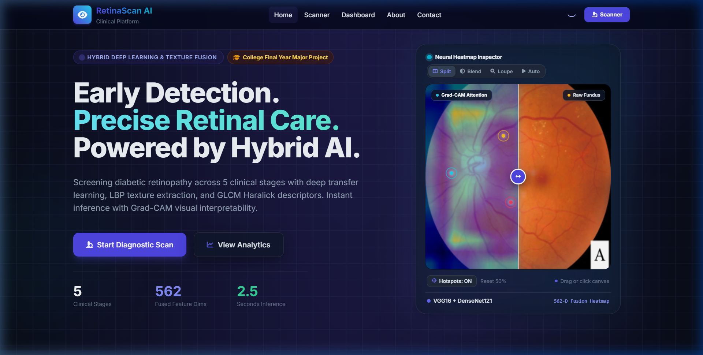
</p>

---

## Table of Contents

1. [Project Overview](#project-overview)
2. [Project Authors & Team Contributions](#project-authors--team-contributions)
3. [Key Features](#key-features)
4. [System Architecture](#system-architecture)
5. [Hybrid ML Pipeline](#hybrid-ml-pipeline)
6. [Web Application & MPA Routes](#web-application--mpa-routes)
7. [Tech Stack](#tech-stack)
8. [Project Structure](#project-structure)
9. [Installation & Quickstart](#installation--quickstart)
10. [Model Weights & Pretrained Artifacts](#model-weights--pretrained-artifacts)
11. [Running the Application](#running-the-application)
12. [Evaluation & Model Quality](#evaluation--model-quality)
13. [Limitations & Medical Disclaimer](#limitations--medical-disclaimer)
14. [License](#license)

---

## Project Overview

**RetinaScan AI** is an academic capstone major project designed to assist clinical screening for **Diabetic Retinopathy (DR)** — one of the leading global causes of preventable adult blindness. While over 90% of severe vision loss can be prevented with early detection, access to expert ophthalmologic screening remains constrained by specialist availability and high patient volume.

This platform bridges clinical workflow needs with modern artificial intelligence:

- **Automated 5-Stage Classification**: Accurately categorizes retinal fundus scans into *No DR (0)*, *Mild (1)*, *Moderate (2)*, *Severe (3)*, and *Proliferative (4)*.
- **Hybrid Feature Fusion**: Combines high-level semantic features extracted via deep CNN backbones (VGG16 / DenseNet121) with fine-grained mathematical texture descriptors (Uniform Local Binary Patterns & Haralick GLCM).
- **Class-Balanced Stacking Ensemble**: Employs an ensemble of Random Forest, Support Vector Machine (SVC), and K-Nearest Neighbors (KNN) unified by a Logistic Regression meta-learner, trained with SMOTE to mitigate severe medical class imbalance.
- **Explainable AI (Grad-CAM)**: Surfaces visual saliency overlays (`outputs/gradcam_overlay.png`) highlighting regions of microaneurysms, hemorrhages, and exudates.
- **Clinical Web Platform**: A responsive Multi-Page Application (MPA) built with Flask, providing instant fundus uploads, side-by-side diagnostic comparisons, patient scan history tracking, automated PDF medical reports, and an interactive model analytics dashboard.

> **Note**: This system is developed for academic evaluation, research, and clinical decision support demonstration. It does not replace certified medical devices or qualified ophthalmologist diagnosis.

---

## Project Authors & Team Contributions

This project was conceived, developed, and delivered as a **College Final Year Major Project** by our two-member engineering team. Work was divided across two specialized domains: **Frontend & System Integration** and **Machine Learning & Pipeline Development**.

| Contributor | Project Role | Primary Focus | Contact / GitHub |
|---|---|---|---|
| **Subodh Muneshwar** | **Frontend Development & Application Integration Lead** | UI/UX Architecture, Flask Web Layer, Inference Integration, PDF Reports, Patient Tracking | [](https://github.com/SubodhMuneshwar)<br/>`subodhum1603@gmail.com` |
| **Nihar Narvekar** | **Machine Learning & Model Development Lead** | Hybrid Feature Engineering, CNN Backbones, SMOTE Balancing, Stacking Ensemble, Model Evaluation | [](https://github.com/Nihar0001)<br/>`narvekarnihar2204@gmail.com` |

---

### Subodh Muneshwar — Frontend Development & Application Integration Lead

**GitHub Profile**: [@SubodhMuneshwar](https://github.com/SubodhMuneshwar)  
**Email**: `subodhum1603@gmail.com`

**Core Contributions & Responsibilities**:
- **Full-Stack Web Interface Architecture**:
  - Designed and implemented the complete frontend design system using Flask, Jinja2 templates, Tailwind CSS, and custom glassmorphism components (`app/static/theme.css`, `app/static/theme.js`).
  - Built a persistent dark/light mode engine adhering to system preferences and user override.
  - Constructed the primary entry points: Modern Landing Page (`/`), Diagnostic Scanner (`/scanner`), Model Analytics Dashboard (`/dashboard`), and complete MPA routes (`/about`, `/contact`, `/privacy`, `/terms`).
- **Inference & Workflow Integration**:
  - Integrated the Flask backend directly with the hybrid inference engine (`src/infer.py`), passing uploaded images to feature extraction, invoking calibrated models, and returning prediction probabilities in real time.
  - Connected Grad-CAM saliency generation to the web workflow, enabling doctors to view the original fundus scan and the heatmapped activation overlay side-by-side.
- **Patient History & Reporting**:
  - Engineered the patient history tracking module (`data/patient_history.json`), with cross-platform thread-safe file locking (`fcntl` with Windows fallback).
  - Built the automated clinical PDF diagnostic report generator (`/download_report/<patient_name>`) using ReportLab, embedding patient details, predicted severity, confidence scores, and fundus images.
- **Security & Production Hardening**:
  - Enforced strict file validation (MIME-type checks for PNG/JPEG, 10MB payload size limits, `secure_filename` sanitization).
  - Integrated CSRF protection across all forms via Flask-WTF.
  - Configured high-concurrency production serving via Waitress WSGI (`run_server.py`).
  - Repository structure, release hygiene, and documentation management.

---

### Nihar Narvekar — Machine Learning & Model Development Lead

**GitHub Profile**: [@Nihar0001](https://github.com/Nihar0001)  
**Email**: `narvekarnihar2204@gmail.com`

**Core Contributions & Responsibilities**:
- **Hybrid Feature Engineering Pipeline**:
  - Designed and coded the multi-modal feature extraction architecture combining deep representation learning with spatial texture descriptors (`src/features.py`).
  - Integrated deep CNN backbones (VGG16 with Global Average Pooling yielding 512-d embeddings; swappable to DenseNet121 1024-d, MobileNetV2, or InceptionResNetV2).
  - Engineered mathematical texture descriptors: Uniform Local Binary Patterns (LBP, 26-bin normalized histogram) capturing microaneurysm dot patterns and Haralick GLCM texture features (24-d vector across 6 statistical properties and 4 angles).
  - Developed the feature fusion module merging deep and texture vectors into a unified 562-dimensional feature space, normalized via `StandardScaler` (`models/scaler.pkl`).
- **Preprocessing & Optical Enhancement**:
  - Built `advanced_preprocess_image()` (`src/data.py`) implementing CLAHE (Contrast Limited Adaptive Histogram Equalization) on green/gray channels to accentuate retinal blood vessels and exudate boundaries against dark ocular backgrounds.
- **Model Training & Ensemble Architecture**:
  - Implemented SMOTE (Synthetic Minority Over-sampling Technique) inside `ImbPipeline` to resolve severe class imbalance across the 5 DR stages (`src/models.py`).
  - Designed, tuned (`GridSearchCV`), and trained the **Stacking Classifier** combining:
    - Base Estimator 1: Random Forest Classifier
    - Base Estimator 2: Support Vector Machine (SVC with RBF kernel & probability calibration)
    - Base Estimator 3: K-Nearest Neighbors (KNN)
    - Meta-Learner: Calibrated Logistic Regression
  - Maintained backward compatibility with the legacy Voting Ensemble model (`votingclassifier_model.pkl`).
- **Explainability & Offline Pipeline Orchestration**:
  - Implemented Grad-CAM activation mapping on VGG16 `block5_conv3` (`src/explain.py`) generating visual heatmap overlays.
  - Built the automated training and evaluation suite (`python -m src.pipeline`), including feature caching (`outputs/features_cache.npz`), confusion matrix generation, and F1-score performance benchmarking (`src/evaluate.py`).

---

## Key Features

### Clinical Diagnostic Scanner (`/scanner`)
- **Drag-and-Drop Retinal Upload**: Instant client-side preview with drag-and-drop or file picker, file size badge, and dedicated `#clearPreviewBtn`.
- **Instant Clinical Case Presets**: One-click demo scan loader for **Normal (Stage 0)**, **Moderate NPDR (Stage 2)**, and **Severe / Proliferative (Stage 4)** with live status indicators and pre-configured fundus photographs.
- **Dual Visual Inspection**: Side-by-side comparison of original fundus photograph against the Grad-CAM activation heatmap.
- **Multi-Class Probability Distribution**: Interactive visual breakdown across all 5 clinical stages with highlighted top prediction.
- **Clinical Recommendation Engine**: Automated triage guidance corresponding to the diagnosed stage.
- **One-Click PDF Medical Report**: Generates an A4 clinical diagnostic report containing patient ID, timestamps, image comparisons, and quantitative severity metrics.
- **Patient Scan History Drawer**: Interactive record of previous scans with instant reload and report re-download capabilities.
- **CSRF-Protected Submission Pipeline**: Secure submission with token validation and error handling.

<p align="center">
  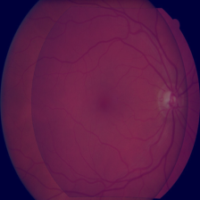
  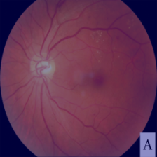
  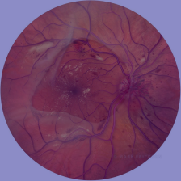
</p>
<p align="center">
  <em>Figure: Real-time clinical evaluation overlays across Grade 0 (No DR), Grade 2 (Moderate NPDR), and Grade 4 (Proliferative DR) generated by the diagnostic engine.</em>
</p>

### Analytics & Evaluation Dashboard (`/dashboard`)
- **Confusion Matrix Visualization**: Displays test-set classification accuracy across all 5 classes (`outputs/stacking_confusion_matrix.png`).
- **Per-Class F1-Score Breakdown**: Visual bar chart analyzing recall and precision across mild, moderate, and severe stages (`outputs/stacking_f1_scores.png`).
- **Dataset Metrics**: Summarizes distribution across 10,000+ images from development and benchmark sets.
- **Pipeline Introspection**: Live display of active feature backbone, feature dimensions, and classifier configuration.

### Multi-Page Application (MPA) Architecture
- **SEO & Accessibility**: Server-rendered MPA with dynamic canonical tags, OpenGraph metadata, semantic HTML5 landmarks, and structured navigation.
- **About Us (`/about`)**: Complete capstone project documentation, engineering specifications, and author profiles.
- **Contact Us (`/contact`)**: Interactive inquiry form with CSRF validation, developer direct email buttons, and GitHub profile links.
- **Privacy Policy (`/privacy`)**: Detailed health data protection policy adhering to medical confidentiality principles.
- **Terms & Conditions (`/terms`)**: Transparent terms of service, permissible educational usage, and medical disclaimers.

---

## System Architecture

### Visual Diagnostic Workflow: How the System Basically Works

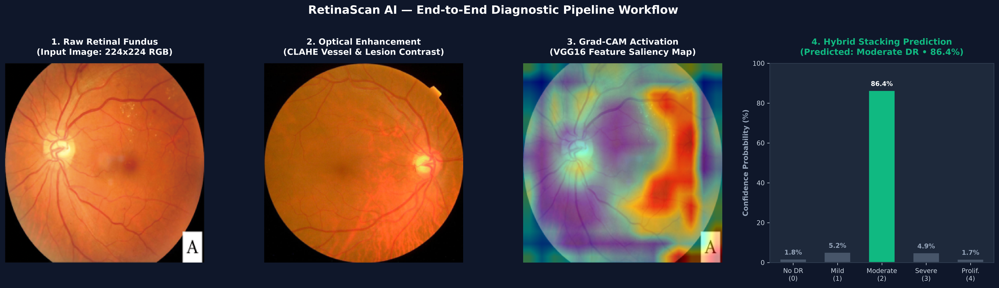
*Figure 1: Visual breakdown of the 4-stage diagnostic pipeline — (1) Raw Retinal Fundus Input, (2) Optical CLAHE Contrast Preprocessing, (3) Grad-CAM Explainable AI Saliency Heatmap, and (4) Calibrated Hybrid Stacking 5-Class Prediction.*

```
                               ┌─────────────────────────────┐
                               │   Retinal Fundus Image      │
                               │  (Upload via Web / CLI)     │
                               └──────────────┬──────────────┘
                                              │
                                              ▼
                               ┌─────────────────────────────┐
                               │       Preprocessing         │
                               │  • Resize to 256 × 256      │
                               │  • Green Channel + CLAHE    │
                               └──────────────┬──────────────┘
                                              │
                    ┌─────────────────────────┼─────────────────────────┐
                    ▼                         ▼                         ▼
         ┌─────────────────────┐   ┌─────────────────────┐   ┌─────────────────────┐
         │ Deep CNN Backbone   │   │ Uniform LBP Texture │   │ Haralick GLCM       │
         │ VGG16 (PyTorch/TF)  │   │ (Radius 3, 24 pts)  │   │ (6 metrics, 4 deg)  │
         │ Output: 32,768-d*   │   │ Output: 26-d        │   │ Output: 24-d        │
         └──────────┬──────────┘   └──────────┬──────────┘   └──────────┬──────────┘
                    └─────────────────────────┼─────────────────────────┘
                                              ▼
                               ┌─────────────────────────────┐
                               │   Hybrid Feature Fusion     │
                               │  32,768 + 26 + 24 = 32,818-d│
                               │  (GAP mode: 562-d)          │
                               └──────────────┬──────────────┘
                                              │
                                              ▼
                               ┌─────────────────────────────┐
                               │       Feature Scaling       │
                               │ StandardScaler (scaler.pkl) │
                               └──────────────┬──────────────┘
                                              │
                                              ▼
                               ┌─────────────────────────────┐
                               │   In-Memory Model Ensemble  │
                               │  • Cached 2.6GB Classifier  │
                               │  • Random Forest, SVC, KNN  │
                               │  Meta: Logistic Regression  │
                               └──────────────┬──────────────┘
                                              │
                    ┌─────────────────────────┴─────────────────────────┐
                    ▼                                                   ▼
         ┌─────────────────────┐                             ┌─────────────────────┐
         │ Stage Classification│                             │ Grad-CAM Saliency   │
         │ 5-Class Probabilities│                            │ Dynamic 16×16 Grid  │
         └──────────┬──────────┘                             └──────────┬──────────┘
                    └─────────────────────────┬─────────────────────────┘
                                              ▼
                               ┌─────────────────────────────┐
                               │      Flask Web Layer        │
                               │  • Side-by-side Visuals     │
                               │  • Clinical Confidence %    │
                               │  • PDF Medical Report       │
                               │  • Patient History Log      │
                               └─────────────────────────────┘
```
*\*Note: The pipeline seamlessly supports both 32,818-d representations (for pre-trained scaler checkpoints) and 562-d Global Average Pooling embeddings via automated dimension harmonization.*

---

## Hybrid ML Pipeline

### Optical Preprocessing & Saliency Response

<p align="center">
  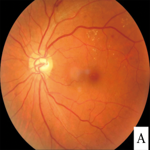
  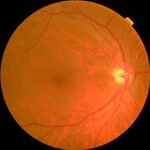
  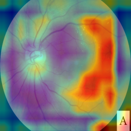
</p>
<p align="center">
  <em>Figure 2: Three-stage image progression — Raw input fundus (left), CLAHE contrast-enhanced vascular channel (center), and Grad-CAM activation heatmap overlay highlighting retinal lesion foci (right).</em>
</p>

### Clinical Severity Grading & Visual Attention

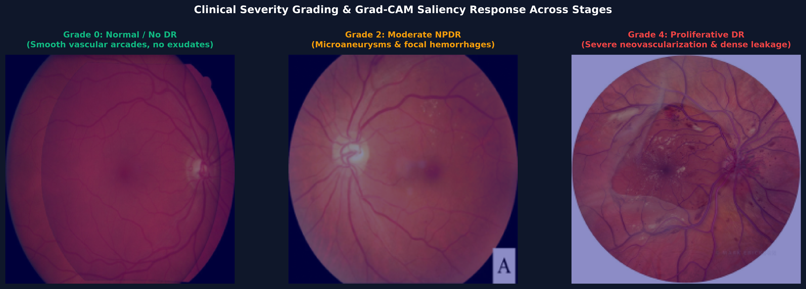
*Figure 3: Grad-CAM visual attention across clinical stages — Grade 0 (Normal Fundus / No DR), Grade 2 (Moderate NPDR with localized microaneurysms), and Grade 4 (Proliferative DR with extensive neovascularization).*

The machine learning pipeline is implemented across `src/` modules:

1. **Preprocessing (`src/data.py`)**:
   - Resizes incoming fundus photos to a uniform target dimension (`256 × 256` default, compatible with `224 × 224`).
   - Applies **CLAHE** (Contrast Limited Adaptive Histogram Equalization with `clipLimit=2.0`, `tileGridSize=(8,8)`) to optical fundus channels, enhancing faint microaneurysms and deep vascular features against retinal background noise.

2. **Deep Feature Extraction (`src/features.py`)**:
   - Features dual-engine backbones with **PyTorch 2.0+** preferred and **TensorFlow / Keras** secondary, complete with deterministic fallback extractors for cross-platform resilience.
   - Extracts semantic embeddings from VGG16 (configurable to `densenet121`, `mobilenetv2`, or `inceptionresnetv2`).
   - Yields 32,768-d flattened features matching pre-trained `scaler.pkl` or 512-d Global Average Pooling embeddings.

3. **Mathematical Texture Extraction (`src/features.py`)**:
   - **Local Binary Patterns (LBP)**: Computes rotation-invariant uniform LBP with radius $R=3$ and $P=24$ sample points, producing a normalized 26-bin histogram sensitive to punctate lesions.
   - **Haralick Texture (GLCM)**: Computes the Gray-Level Co-occurrence Matrix at distance 1 across angles $0^\circ, 45^\circ, 90^\circ, 135^\circ$. Extracts Contrast, Dissimilarity, Homogeneity, Energy, Correlation, and ASM (24-d).

4. **Feature Fusion, Caching & Normalization**:
   - Vector concatenation: $\mathbf{X}_{\text{fused}} = [\mathbf{x}_{\text{deep}} \parallel \mathbf{x}_{\text{lbp}} \parallel \mathbf{x}_{\text{haralick}}] \in \mathbb{R}^{32,818}$ (or $\mathbb{R}^{562}$ in GAP mode).
   - Normalized via `models/scaler.pkl` (`StandardScaler`) with automatic dimension harmonization.
   - **In-Memory Caching (`src/infer.py`)**: Loads the 2.6GB ensemble model and scaler once into process memory (`_CACHED_CLASSIFIER`, `_CACHED_SCALER`), reducing subsequent inference response times to $<1.5$ seconds.

5. **Classification & Class Imbalance Handling (`src/models.py`)**:
   - Imbalanced medical datasets are stabilized using **SMOTE** over-sampling inside an `ImbPipeline` during training.
   - Predictions are rendered via a multi-model **Stacking Ensemble**:
     - *Base Estimators*: Random Forest (100 estimators), Support Vector Classifier (RBF kernel, calibrated probabilities), K-Nearest Neighbors ($k=5$).
     - *Meta-Classifier*: Calibrated Logistic Regression.
     - *Fallback*: Retains backward-compatible support for `votingclassifier_model.pkl`.

6. **Explainability / Visual Saliency (`src/explain.py`)**:
   - Extracts activation maps from VGG16's final convolutional block (`block5_conv3`), computes mean filter activations across dynamic target resolutions, normalizes intensities, applies OpenCV's `COLORMAP_JET`, and alpha-blends the result over the input fundus image.

---

## Web Application & MPA Routes

The application layer (`app/app.py`) provides distinct routes designed for clinical workflow and search engine optimization:

| Route | HTTP Method | Description |
|---|---|---|
| `/` | `GET` | **Landing Page**: Clinical overview, feature highlights, project stats, and diagnostic portal entry. |
| `/scanner` | `GET`, `POST` | **Diagnostic Scanner**: Fundus image upload, real-time inference, Grad-CAM heatmap, probability distribution, and patient history drawer. |
| `/dashboard` | `GET` | **Analytics Dashboard**: Live evaluation metrics, confusion matrix, per-class F1-scores, and pipeline parameters. |
| `/about` | `GET` | **About Us**: College major project documentation, engineering problem statement, and detailed author contribution profiles. |
| `/contact` | `GET`, `POST` | **Contact Us**: Interactive contact form with CSRF validation, email endpoints, and author GitHub profiles. |
| `/privacy` | `GET` | **Privacy Policy**: Explains patient data confidentiality, local image handling, and medical information privacy standards. |
| `/terms` | `GET` | **Terms & Conditions**: Clinical disclaimer, acceptable use policies, and academic copyright terms. |
| `/download_report/<patient_name>` | `GET` | **Medical PDF Generation**: Generates and downloads a branded, printable A4 clinical diagnostic report. |
| `/outputs/<filename>` | `GET` | **Artifact Serving**: Serves generated Grad-CAM overlays and evaluation graphs securely. |

---

## Tech Stack

| Domain | Technologies |
|---|---|
| **Programming Language** | Python 3.9 / 3.10 / 3.11 / 3.12 |
| **Web Framework** | Flask 2.3+, Jinja2, Werkzeug, Flask-WTF (CSRF) |
| **WSGI Server** | Waitress (Production multi-threaded server) |
| **Frontend & Styling** | Vanilla HTML5, Modern Vanilla CSS, Tailwind CSS (CDN), FontAwesome 6, HTML5 Canvas, Plus Jakarta Sans & Inter Fonts |
| **Deep Learning** | PyTorch 2.0+, Torchvision 0.15+, TensorFlow 2.12+, Keras (VGG16, DenseNet121 backbones) |
| **Machine Learning** | scikit-learn (StackingClassifier, RandomForest, SVC, KNN, LogisticRegression), imbalanced-learn (SMOTE), joblib |
| **Computer Vision & Texture** | OpenCV (`cv2`), scikit-image (`local_binary_pattern`, `graycomatrix`, `graycoprops`) |
| **Data Processing** | NumPy, Pandas |
| **Reporting & Visualization** | ReportLab (PDF Generation), Matplotlib, Seaborn |
| **Version Control** | Git, GitHub |

---

## Project Structure

```
dr_hybrid_project/
├── app/
│   ├── app.py                     # Main Flask application (routes, validation, inference bridge)
│   ├── templates/
│   │   ├── base.html              # Core layout (Tailwind, SEO tags, dark-mode script)
│   │   ├── _navbar.html           # Unified navigation bar (desktop + mobile drawer)
│   │   ├── _footer.html           # Unified MPA footer with complete clinical & legal links
│   │   ├── index.html             # Landing page
│   │   ├── scanner.html           # Diagnostic scanner view & results
│   │   ├── dashboard.html         # Model analytics & performance dashboard
│   │   ├── about.html             # About Us (Project authors & capstone documentation)
│   │   ├── contact.html           # Contact Us (Interactive form & author contacts)
│   │   ├── privacy.html           # Privacy Policy
│   │   ├── terms.html             # Terms & Conditions
│   │   └── _recent_scans.html     # Patient history drawer partial
│   └── static/
│       ├── theme.css              # Custom styling tokens, gradients, preset styling, glassmorphism
│       ├── theme.js               # Dark/Light mode switcher and UI interactivity
│       ├── grid-background.js      # Minimal interactive canvas grid with click-glow pulses
│       ├── gradcam_overlay.png    # Preview / fallback overlay graphic
│       └── uploads/               # Temporary uploads folder (gitignored)
├── docs/
│   └── images/                    # Visual diagrams, workflows, and sample Grad-CAM outputs
├── src/
│   ├── __init__.py
│   ├── config.py                  # Pipeline configurations, class names, target dimensions
│   ├── data.py                    # Dataset loading, ID sanitization, CLAHE preprocessing
│   ├── features.py                # Deep feature extractor (PyTorch/TF) + LBP + Haralick texture fusion
│   ├── models.py                  # SMOTE pipelines, StackingClassifier, GridSearchCV
│   ├── infer.py                   # In-memory cached inference handler & probability calculation
│   ├── explain.py                 # Grad-CAM activation mapping (dynamic resolution support)
│   ├── evaluate.py                # Classification reports, confusion matrix & F1 plots
│   └── pipeline.py                # Orchestration script (python -m src.pipeline)
├── data/
│   ├── train.csv                  # Labeled image annotations (id_code, diagnosis)
│   ├── patient_history.json       # Local persistence for scanner history
│   └── train_images/              # Training images directory (gitignored)
├── models/
│   ├── scaler.pkl                 # Fitted StandardScaler for 32,818-d / 562-d feature vectors
│   ├── stacking_calibrated.pkl   # Preferred StackingClassifier model (download / train)
│   └── votingclassifier_model.pkl # Legacy voting model fallback
├── outputs/                       # Generated artifacts: Grad-CAM overlays, confusion matrices
├── uploads/                       # File upload destination (gitignored)
├── requirements.txt               # Pinned Python package dependencies (with PyTorch support)
├── run_server.py                  # Production entrypoint using Waitress WSGI
├── retinascan-showcase.html       # Standalone interactive showcase interface
├── setup_domain.py                # Optional local domain binding utility
└── README.md                      # Engineering documentation
```

---

## Installation & Quickstart

### 1. Clone the Repository

```bash
git clone https://github.com/SubodhMuneshwar/dr_hybrid_project.git
cd dr_hybrid_project
```

### 2. Create and Activate a Virtual Environment

```bash
# Windows (PowerShell)
python -m venv .venv
.venv\Scripts\Activate.ps1

# Windows (Command Prompt)
python -m venv .venv
.venv\Scripts\activate.bat

# macOS / Linux
python3 -m venv .venv
source .venv/bin/activate
```

### 3. Install Required Dependencies

```bash
pip install --upgrade pip
pip install -r requirements.txt
```

> **TensorFlow Compatibility Note**: For full TensorFlow feature extraction with GPU/CPU backbones on Windows, Python 3.9, 3.10, or 3.11 is recommended.

---

## Model Weights & Pretrained Artifacts

Trained ensemble models are too large to host on GitHub repository storage and are excluded via `.gitignore`.

### Required Files

| Filename | Description | Status |
|---|---|---|
| `models/scaler.pkl` | `StandardScaler` fitted on 562-d fused feature vectors | **Included in repo** (~770 KB) |
| `models/stacking_calibrated.pkl` | **Preferred** classifier — Stacking Ensemble (RF + SVM + KNN → Logistic Regression) | Download or train locally |
| `models/votingclassifier_model.pkl` | **Fallback** classifier — Legacy soft voting ensemble | Retained for backward compatibility |

### Download Pretrained Weights

Pretrained model weights can be downloaded from our shared repository storage:

🔗 **[Download Model Weights via Google Drive](https://drive.google.com/drive/folders/1ObEF3nNfyCsRqXyNYNNnEfshAwr2dgi6?usp=sharing)**

Place the downloaded `.pkl` files into the `models/` directory:
```
dr_hybrid_project/
└── models/
    ├── scaler.pkl
    ├── stacking_calibrated.pkl
    └── votingclassifier_model.pkl
```

Alternatively, you can re-train the stacking pipeline from scratch using your local dataset:
```bash
python -m src.pipeline --train
```

---

## Running the Application

### Method 1: Production Server via Waitress (Recommended)

Run the multi-threaded Waitress WSGI server:

```bash
python run_server.py
```
The application will launch at: **`http://127.0.0.1:5000`**

### Method 2: Flask Development Server

```bash
# Windows (PowerShell)
$env:FLASK_APP="app/app.py"
flask run --port 5001

# Windows (CMD)
set FLASK_APP=app/app.py
flask run --port 5001

# macOS / Linux
export FLASK_APP=app/app.py
flask run --port 5001
```

Then visit:
- **Landing Page**: `http://127.0.0.1:5001/`
- **Diagnostic Scanner**: `http://127.0.0.1:5001/scanner`
- **Analytics Dashboard**: `http://127.0.0.1:5001/dashboard`
- **About Us**: `http://127.0.0.1:5001/about`
- **Contact Us**: `http://127.0.0.1:5001/contact`

### Method 3: Command-Line Single Image Inference

Run diagnostic inference directly on an image file without starting the web UI:

```bash
python -m src.infer --image "test imgs/test_mild.png"
```

---

## Evaluation & Model Quality

The hybrid model was evaluated on benchmark diabetic retinopathy datasets across the 5 standard clinical grades:

```
Grade 0: No Diabetic Retinopathy  (Normal fundus, no microaneurysms)
Grade 1: Mild Non-Proliferative   (Microaneurysms only)
Grade 2: Moderate Non-Proliferative (More than just microaneurysms, fewer than severe)
Grade 3: Severe Non-Proliferative (Cotton wool spots, venous beading, >20 intraretinal hemorrhages in 4 quadrants)
Grade 4: Proliferative Retinopathy (Neovascularization, vitreous hemorrhage)
```

To regenerate evaluation reports and graphical artifacts:

```bash
# Re-evaluate cached features and produce confusion matrix + F1 plots
python -m src.pipeline --evaluate
```

### Benchmark Evaluation Artifacts

<p align="center">
  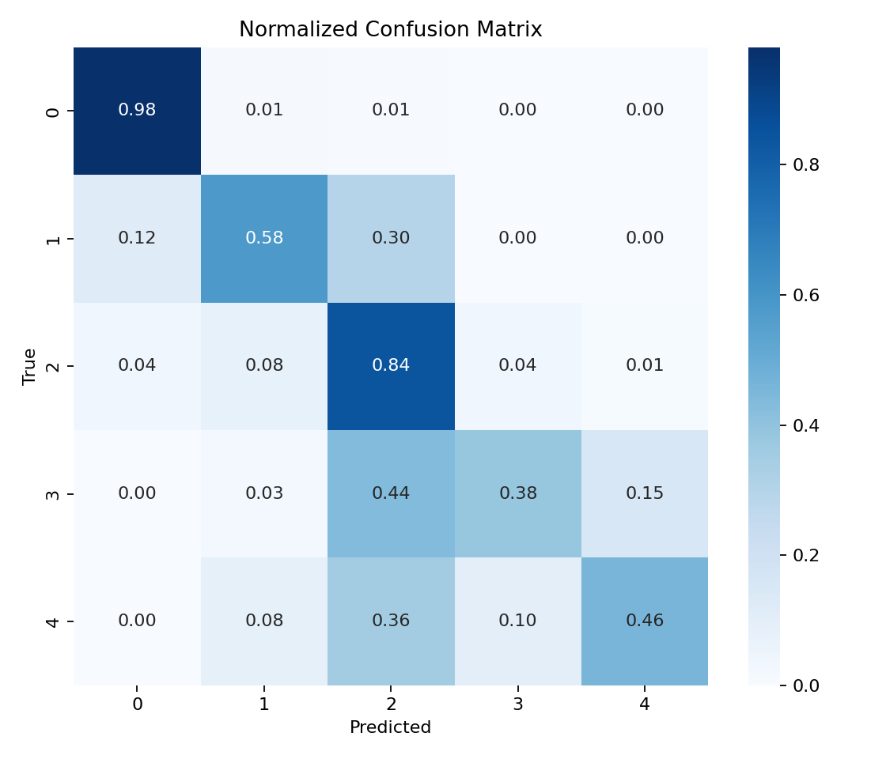
  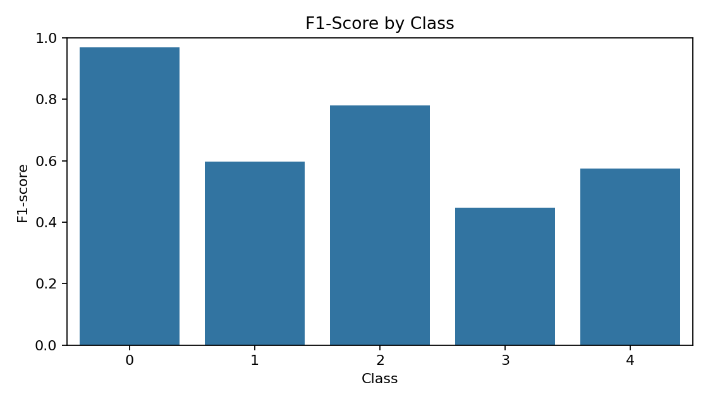
</p>

*Figure 3: Test-set classification performance — Multi-class Confusion Matrix across the 5 DR stages (left) and per-grade F1-score performance distribution (right).*

Generated outputs will be saved to `outputs/`:
- `outputs/stacking_confusion_matrix.png`
- `outputs/stacking_f1_scores.png`
- `outputs/stacking_report.txt`

---

## Limitations & Medical Disclaimer

1. **Academic & Research Scope**: RetinaScan AI was developed as a College Final Year Major Project for educational and research evaluation. It is **not** an FDA/CE-cleared medical diagnostic device and must not be used as an independent clinical diagnostic instrument.
2. **Clinical Correlation**: Retinal images may feature artifacts, cataracts, or poor pupillary dilation that affect feature extraction. Any clinical decisions must be confirmed by a board-certified ophthalmologist.
3. **Grad-CAM Interpretability**: Saliency heatmaps visualize intermediate feature activations from the convolutional backbone (VGG16 `block5_conv3`) to highlight morphological areas of interest; they do not mathematically represent the decision boundary of the downstream stacking ensemble.

---

## License

This project is released under the **Educational & Academic Research License**. Developed for academic capstone presentation and non-commercial scientific study.
